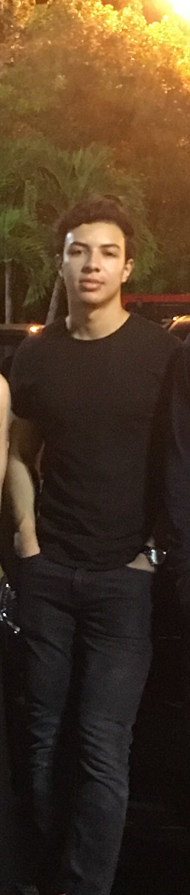

---
---

<link rel="stylesheet" href="styles.css" type="text/css">

Greetings, I am Acxel Vega, a student at [Miami Dade College](https://www.mdc.edu), majoring in _Computer Science_. My desire of problem-solving and making a strong impact in society is why I aspire to become a Software Engineer. After receiving my A.A. from Miami Dade College, I plan to transfer to [Florida International University](https://www.fiu.edu/) to receive my B.S. in _Computer Science_. Currently I am taking advantage of any opportunity that comes my way to maximize my skill set. 

Check out my Summer Research Project (SRI) in the projects tab, and feel free to contact me if you have any questions. 

Some of my interests include:

- Traveling to new places and enjoying the beauty of life

- Exercising

- Avid car person